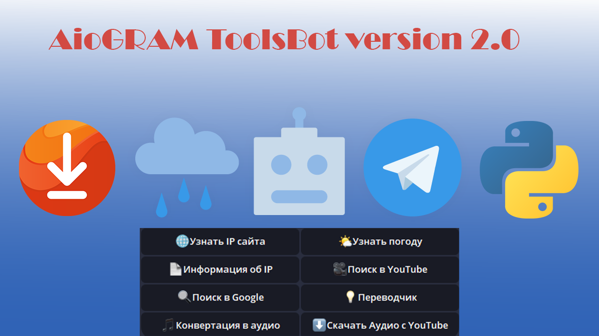
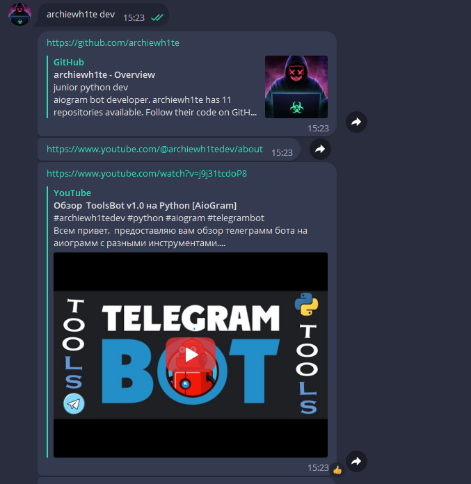
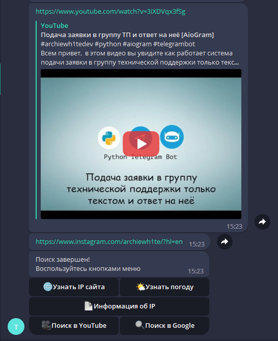
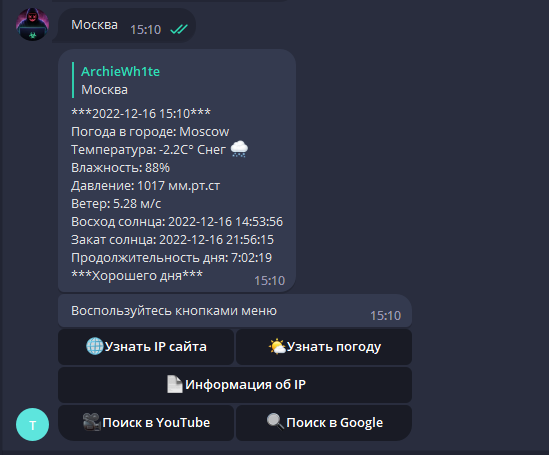
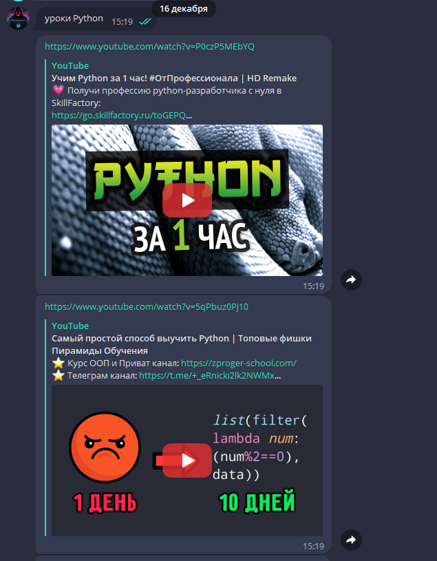
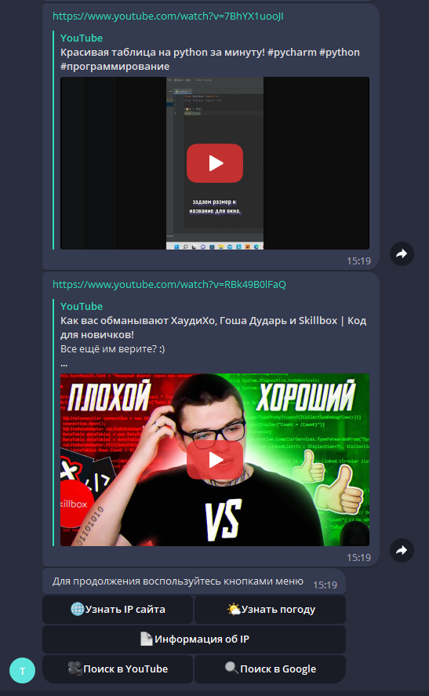
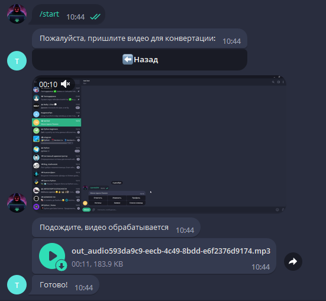
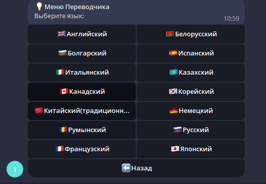
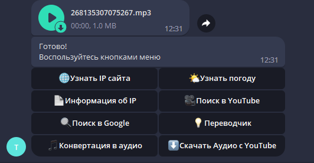

**ToolsBot v2.0**

**Author:** [@ArchieWh1te](https://t.me/archiewh1te)

**Language:** Python 3.8

**library pypi:** python-dotenv, aiogram, requests, folium, google, youtube-search-python, moviepy, pytube, googletrans

**License:** Free

### Бот с инструментами

**Видео:**

**Описание:**

Бот имеет 8 функций: Поиск в Google, Поиск в YouTube, может узнать погоду, показывает информацию об IP и может определить IP сайта, переводить текста, получать аудио из видео, скачивать аудио из видео с ютуба.  

Бот написан на асинхронной библиотеке **aiogram** в хорошей структуре и расположении файлов.

Для того чтобы работала погода вам надо зарегистрироваться на сайте https://openweathermap.org/ и получить **ТОККЕН**, далее записать его в файл *.env* в переменную *open_weather_key* (токен должен быть в двойных кавычках " ")

Для работы бота запускаем файл *app.py*.

Нужно создать папку *location* В НЕЙ будет хранится спарсиный html с картой IP адреса который мы вводим у бота.

**Скриншоты**

*Клавиатура*

*Поиск в Google(Выдаст 5 ссылок)*

*Узнать IP сайта*

*Узнать погоду*

*Поиск в YouTube(Выдаст 5 ссылок)*

*Узнать информацию об IP*

*Конвертация аудио из видео*

*Переводчик*

*Скачать аудио из видео с YouTube*

